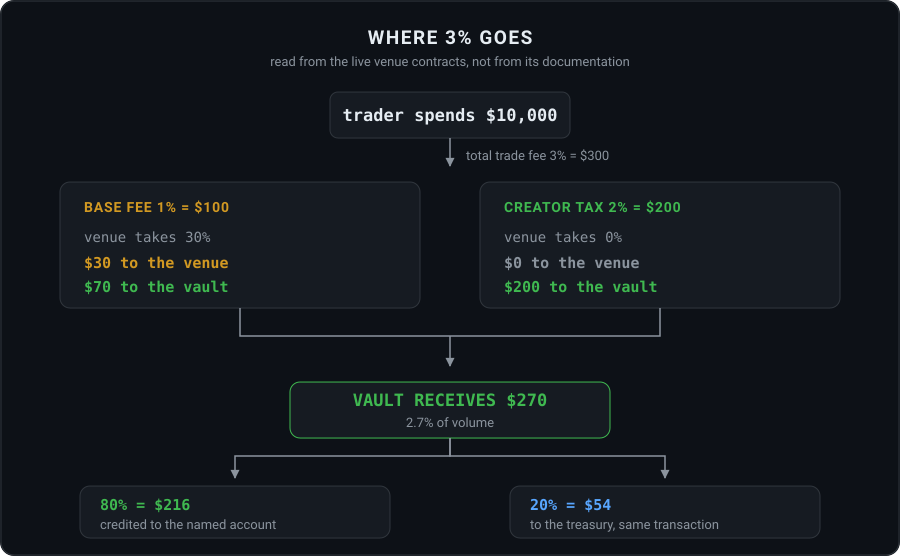
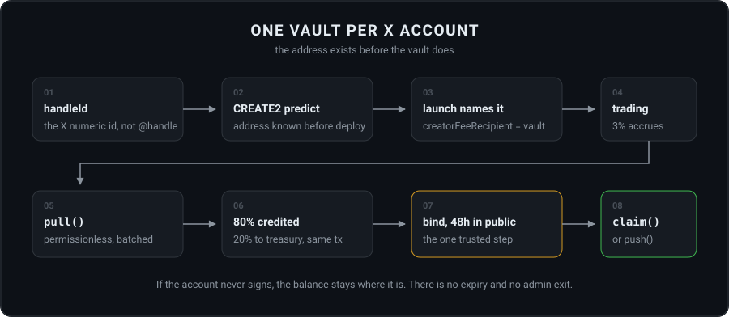
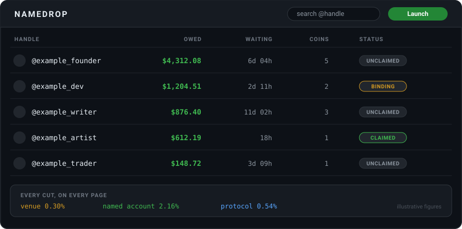
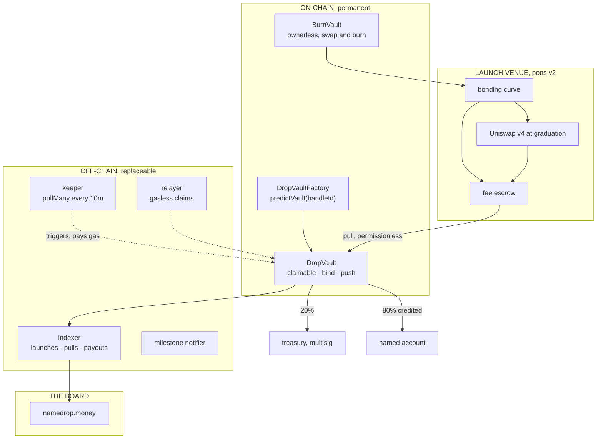

<div align="center">


# Namedrop

**Launch a coin for anyone on X. The fees become theirs, and we cannot take them back.**

Namedrop is a fee bridge that never holds the fee. Point a coin's creator fees at any public X account and 80% of what accrues is credited on-chain, in a vault only that account can empty, with no signup, no expiry, and no function anywhere in the contract that moves it to us.

<br>


[Website](https://namedrop.money) · [Docs](https://namedrop.money/docs) · [X](https://x.com/namedropRH)

</div>

---

## What Namedrop is

Every launch needs the same impossible thing: a reason for a large account to notice it. That attention cannot be bought directly. A paid post reads as a paid post and a tag reads as spam.

Money already sitting on-chain with someone's name on it is harder to scroll past.

Namedrop routes a coin's creator fees into a vault derived from an X account's permanent numeric ID. Trading credits that vault. The named account claims whenever it wants, or never, and the balance does not move either way.

**What Namedrop is not:**

| | |
|---|---|
| Not a payments company | Nothing moves off-chain. No fiat float is held. |
| Not a custodian | No function exists that can move a recipient balance to the treasury. |
| Not an endorsement engine | A named account owes us nothing. Being named implies no relationship. |
| Not a launchpad | pons v2 launches the token. Namedrop only routes where the creator fee lands. |

---

## The fee math

Namedrop charges a 3% total trade fee. That is more expensive than a 1% default, and the reason is printed on every coin page rather than hidden.

The venue charges a 1% base fee and keeps 30% of it. Namedrop adds a 2% creator tax on top, and the venue's own contract takes nothing from that tax. So 3% nets the vault 2.7% of volume, not 2.1%.

<div align="center">

</div>

| Volume | Trade fee | Venue | Named account | Namedrop |
|---:|---:|---:|---:|---:|
| $10,000 | $300 | $30 | **$216** | $54 |
| $50,000 | $1,500 | $150 | **$1,080** | $270 |
| $100,000 | $3,000 | $300 | **$2,160** | $540 |
| $500,000 | $15,000 | $1,500 | **$10,800** | $2,700 |
| $2,000,000 | $60,000 | $6,000 | **$43,200** | $10,800 |

A 1% default nets a recipient 0.56% of volume. Namedrop nets them **2.16%**, roughly four times more, for the same trade at the same venue.

All three cuts are shown on every token page, every time. Publishing the number that makes us look smaller is the cheapest credibility available in this category.

### Venue parameters

Read from the live contracts rather than from documentation. These are owner settable at the venue, so the indexer re-reads them every hour and the board renders whatever is true now.

| Parameter | Value | Meaning |
|---|---|---|
| `curveFeeBps` | `100` | 1% base fee, pre-graduation |
| `hookFeeBps` | `100` | 1% base fee, post-graduation |
| `protocolFeeShareBps` | `3000` | venue keeps 30% of the base fee |
| `maxCreatorTaxBps` | `1000` | creator tax ceiling, 10% |
| `MAX_TOTAL_TRADE_FEE` | `2000` | total fee ceiling, 20% |
| `launchFee` | `0.0005 ETH` | paid once at launch |
| graduation | `4.2 ETH` | curve moves to Uniswap v4 |
| supply | `1,000,000,000` | per launched coin |

Namedrop sets `creatorTaxBps = 200`. The base fee is fixed by the venue and cannot be changed by a launcher.

---

## How it works

<div align="center">

</div>

### One vault per X account

The vault address is a CREATE2 clone predicted from the account's **stable numeric ID**, not from the `@handle` string.

That detail carries more weight than it looks like it should. Handles are rentable: an account can free a name and somebody else can take it within seconds. Key a vault on the string and a rename becomes a theft vector. Key it on the numeric ID and a rename changes nothing, permanently.

Because the address is predictable, a launch can name an account the same second somebody types it in. The vault deploys lazily, on first need.

Five coins launched for the same account feed **one** balance. The board shows one row: the amount, the coin count, and how long it has been waiting. Splitting per token produces dust nobody notices.

### Two verbs, both permissionless

```solidity
pullMany(address[] vaults)      // fees leave the venue escrow, 80/20 applied
push(address vault, address asset)  // credited balance goes to the bound address
```

**pull.** Trading accrues fees into the venue's escrow, credited to the vault's address. A keeper reads `pendingInEscrow()` across every known vault every ten minutes and batches a `pullMany()` once the sum clears 0.1 ETH. 80% is credited to `claimable[handle]` inside the vault, 20% transfers to the treasury in the same transaction.

The threshold is not about gas. A batched pull across fifteen vaults costs about **$0.022** on this chain, roughly **$0.0015** per vault, measured on-chain. The threshold exists to stop dust pulls and keep the loop quiet when nothing is trading.

**push.** Sends the credited balance to the vault's bound address. Anyone may call it and pay the gas. **The destination is not a parameter.** The protocol can trigger a payment, fund it, and still have no say in where it lands.

### The only three exits

```
claim(asset, to)        the bound account signs and picks the destination
claimWithSig(...)       the account signs, a relayer submits, gas is on us
push(asset)             anyone triggers, destination is the bound address
```

There is no `settleOffchain()`. No `rescue()`, no `sweep()`, no expiry, no admin withdrawal.

The absence of the function **is** the product.

`MIN_RECIPIENT_BPS = 5000` lives in the contract, not in the docs. The recipient share can be raised and can never be set below half, by anyone, ever.

### Binding, the one trusted step

No on-chain method can prove an address belongs to an X account. An oracle is unavoidable. We are that oracle, and the honest response is not to pretend otherwise. It is to make the step impossible to perform quietly.

```
account signs in with X
      │
      ▼
requestBind(handleId, address)     emits a public event
      │
      ├─ the handle page shows a banner immediately with the pending address
      ├─ an automated post announces it
      └─ 48 HOURS
            │
            ▼
      executeBind()                permissionless after the window
```

A wrong or malicious bind is visible for two days, in public, on the page carrying that person's own name, in front of their own audience, before it can move a cent. The operator cannot shorten the window.

---

## The Wall

The board is the entire product. It ranks on amount owed, then on time waiting, then on coin count.

<div align="center">

</div>

Time waiting is the column that does the real work. It is the difference between a list of balances and a public record of who has been owed something, and for how long.

Status badges are earned by state and are never purchasable:

| Badge | Meaning |
|---|---|
| `UNCLAIMED` | has never signed in |
| `BINDING` | inside the 48h window, pending address shown |
| `CLAIMED` | has withdrawn at least once |
| `OPTED OUT` | removed at their own request |
| `FASTEST` | claimed within 24h of first being named |

A pinned handle, paid for by burning `$DROP`, sits in its own strip **above** the board and never inside the ranking. The ranking is not for sale at any price, because the neutrality of the board is the only asset the protocol has.

### Anti-gaming

| Attack | Defence |
|---|---|
| Rename into a freed handle to steal a vault | `handleId` is the X numeric id. A rename changes nothing. |
| Wash-trade to fake a board number | Volume is visible. The board prints coin count and age beside the amount, so a single-wallet spike reads as one. |
| Launch spam at one handle | The board aggregates per handle. Fifty coins are still one row. |
| Bind someone else's handle | 48h public window, pending address shown to that person's own audience. |
| Name a private individual to harass them | Do-not-name list, blocked at the launch input, opt-out honoured within 7 days. |
| Name yourself and claim | Allowed and harmless. It is your own coin's fees, and the board labels self-named coins. |

### Notification discipline

Milestones only: `$5`, `$25`, `$100`, `$500`, `$1,000`, then every `$1,000`. One post per handle per milestone, never per pull.

Silence is the default state. A quiet week produces zero posts and that is correct behaviour. An account that replies asking us to stop is treated as an opt-out immediately, without being sent a form.

---

## Architecture



Everything in the off-chain column is a convenience. If all of it stopped, `pull` and `push` remain callable by anyone, and every balance still reaches the account it belongs to.

### Key separation

| Key | Can do | Holds funds |
|---|---|---|
| keeper (hot) | `pullMany` only | no |
| relayer (hot) | submit signed claims | gas only |
| treasury | receive the protocol cut | yes, multisig |
| factory owner | set treasury, raise the recipient share, never below 50% | no |

No key in the system can move a recipient balance. Compromise of every hot key costs us gas, and costs named accounts nothing.

---

## $DROP

`$DROP` is the **last** coin Namedrop launches, not the first. A fee product whose only live coin is its own token has demonstrated nothing.

The gate is a single roadmap line: **the first third-party withdrawal**. A real account that is not ours, binding a real address, moving a real balance out.

### Distribution

| | |
|---|---|
| Supply | 1,000,000,000 |
| Venue | pons v2, launch config 0 |
| Team allocation | **0%** |
| Pre-sale | none |
| Distribution | 100% through the curve |
| Liquidity | permanently locked at graduation by the venue's own locker, not by us |

### Its own creator fees

`$DROP` launches like any other coin on Namedrop, with one difference. Its creator fee recipient is a **BurnVault**:

- no owner, no admin function
- receives the 80% recipient share of `$DROP`'s own fees
- swaps for `$DROP` on the open market and burns it
- callable by anyone, and we hold no key to it

### What the token buys

| Tier | Access |
|---|---|
| Any holder | full board, all handle pages, launcher badge on coins you created, board alerts for handles you follow |
| 0.1% supply | everything above, plus pin credits monthly and the read API for the full owed ledger |
| 0.5% supply | everything above, plus early access to new board surfaces and a vote on what gets built next |
| **Never, at any tier** | a larger share of any fee · faster or prioritised payment · the ability to hide, delay or reorder a balance |

A holder's fee split is identical to a non-holder's. Claiming is free and gasless for every account, holder or not. A paywall on your own money is not a business model.

The reasoning is structural rather than generous. The moment holding `$DROP` raises a launcher's share, Namedrop acquires a reason to favour one coin over another, and the board stops being a neutral record. The board's neutrality is the asset. The token is downstream of it, never upstream.

---

## Revenue

**20% of every pull, which is 0.54% of all trading volume.** That is the entire business.

No launch fee of our own, no listing fee, no claim fee, no subscription, no priority tier, no take on the recipient's side. If nobody trades, we earn nothing.

| Cost line | Monthly |
|---|---:|
| production infra and managed database | ~$60 |
| chain data provider | ~$50 |
| keeper gas, batched | ~$15 |
| relayer gas for gasless claims | ~$10 |
| domain and edge | ~$10 |
| contingency | ~$55 |
| **Total** | **~$200** |

Break-even sits at roughly **$37,000 of monthly trading volume** across all coins. One moderately active coin clears it in a day.

Allocation of the protocol cut: **50%** buyback and burn, **25%** operations, **15%** development, **10%** reserve for incident response. Published on the flow page with the treasury address, reconcilable against the chain by anyone.

Every buyback is labelled a buyback. It is never counted as a payout, never mixed into the owed figure, and never presented as evidence that the product works.

### The honest base rate

Measured on the incumbent's first 24 hours: seventeen coins, $21.6k of creator fees, of which **$18.7k came from the protocol's own coin**. The remaining sixteen split under $3k. Median third-party earnings: under twenty dollars.

At Namedrop's 3% that median rises to roughly **$54**. Still small.

This is a power-law product. Fifteen coins will die quiet and one will put a five-figure number on the board. The design takes that seriously: the board must read well when the numbers are tiny, the notifier must stay silent when nothing is happening, and a named account is never promised earnings. They are promised the share, the custody and the permanence, because those are the three things the protocol actually controls.

---

## Verify it yourself

Do not trust the board. Check it. The whole sequence takes about thirty seconds.

1. Open the contract on the explorer and grep for an admin withdrawal path. There is none.
2. Read `push()`. Confirm it takes no destination argument.
3. Find `MIN_RECIPIENT_BPS`. It is `5000`.
4. Open a handle's vault balance on the explorer and compare it to the number the board shows.

The two numbers match, and you can check again tomorrow.

Phase 1 ships with an explicit test asserting that **no path moves `claimable` to the treasury**. That test is the promise, written in code, and it fails the build if it ever stops being true.

---

## Roadmap

| Phase | Scope | Status |
|---|---|---|
| **0** Verification | venue splits read from live contracts, creator tax confirmed to bypass the venue cut, batched pull gas measured on-chain, incumbent audited end to end | mostly done |
| **1** Contracts | DropVault, DropVaultFactory, 48h bind window, `push()` with fixed destination, fork tests, the no-admin-exit test, source verified | weeks 1-2 |
| **2** Indexer and board | owed as claimable plus in-escrow, sortable board, permanent handle pages, three-cut strip, public ledger CSV | weeks 2-3 |
| **3** Launch and claim | one-transaction launch page, X sign-in and bind banner, gasless claim, opt-out page, docs with the venue-override risk stated plainly | weeks 3-4 |
| **4** First real payout | seed coins, milestone notifier, **first third-party withdrawal** | weeks 4-6 |
| **5** `$DROP` | ownerless BurnVault, token launch, buyback routine, pin sink, data API | after phase 4 |
| **6** Surfaces | launcher pages and leaderboard, selectable creator tax 0-9%, ERC-20 pairs, embeddable board widget, published post-mortem for every incident | months 3-6 |

---

## Risks, stated plainly

| | Risk |
|---|---|
| 🔴 | **Venue override.** The launch venue's owner can reroute any coin's creator fee recipient after a three-day timelock, and the current recipient cannot veto it. This applies to every coin on the venue, ours included. |
| 🔴 | **Identity oracle.** Deciding which address belongs to an X account cannot be done on-chain. We do it. The 48h public window bounds the damage. It does not remove the trust. |
| 🟠 | **3% is expensive** for traders next to a 1% default. Stated on every coin page with the reason. |
| 🟠 | **Naming without consent** can read as harassment. Opt-out on day one, do-not-name list, strict cadence, low bar for honouring a request. |
| 🟠 | **Platform policy.** Automated posts live at the mercy of the platform's rules. Milestone-only cadence is both courtesy and survival. |
| 🟡 | **Power law.** Most coins earn almost nothing. The board must read well while small and must never promise earnings. |
| 🟡 | **Dead capital.** Balances for accounts that never claim sit forever. That is the cost of the promise, and the protocol pays it. |

---

## The one-sentence moat

Anyone can copy this mechanic. The contracts are simple and a competent team could rebuild them in a weekend, and that is fine, because the code was never the defensible part.

> Almost nobody will give up the ability to touch the float, and the ones who already built that ability in cannot remove it without explaining what it was for.

---

## Links

| | |
|---|---|
| Board and app | [namedrop.money](https://namedrop.money) |
| Docs | [namedrop.money/docs](https://namedrop.money/docs) |
| X | [@namedropRH](https://x.com/namedropRH) |
| GitHub | [github.com/namedropRH](https://github.com/namedropRH) |
| Chain | Robinhood Chain, EVM, chainId `4663` |
| Venue | pons v2, bonding curve into Uniswap v4 |

---

<div align="center">
<sub>

Namedrop is experimental software. `$DROP` is a token with no claim on revenue, profit, equity or any promise of value.<br>
Nothing here is financial, legal or tax advice.

A coin may name any public X account. Being named creates no relationship between that account and Namedrop, implies no<br>
endorsement of the coin, and places them under no obligation. Any account may ask to be removed and the request will be<br>
honoured. Funds already credited to an account remain theirs regardless.

Namedrop does not custody fiat, does not operate a payment rail, and does not move value off-chain. Namedrop is not affiliated<br>
with X Corp, with Robinhood, or with the launch venue. Smart contracts can contain defects. Token values can go to zero.<br>
Do your own research and risk only what you can afford to lose.

</sub>
</div>
